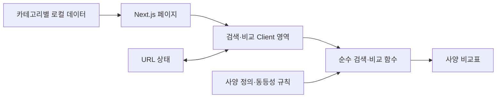

# 전자기기 사양 비교 웹: 초기 아키텍처·패키지 후보

작성일: 2026-09-18 · 상태: 검토용 설계안

**추천 방향은 기존 Next.js 구성을 유지하고, 기능별 모듈 + 카테고리별 사양 정의 + 로컬 데이터로 시작하는 것이다.** 비교표는 HTML `<table>`로 만들고, 공유할 상태는 URL, 일시적인 조작 상태는 React에서 관리한다. 아래의 추천·보류 판단은 이 프로젝트의 초기 규모를 가정한 설계 의견이다.

이 문서는 후보와 선택 이유를 정리한다. 패키지 설치와 애플리케이션 구현은 수행하지 않았으며, API·DB·인증·외부 데이터 수집은 설계 범위에서 제외한다.

## 1. 현재 프로젝트와 설계 가정

### 확인한 구성

`package.json`, `pnpm-lock.yaml`, `tsconfig.json`, `app/` 기준이다. 버전은 현재 프로젝트에서 확인한 값이며 새로 설치할 버전 추천과 구분한다.

| 항목 | 현재 상태 | 초기 판단 |
| --- | --- | --- |
| 프레임워크 | Next.js `16.3.5`, App Router | 유지 |
| UI | React / React DOM `19.2.8` | 유지 |
| 언어 | TypeScript `^5`, lockfile `5.9.3`, `strict: true` | 유지 |
| 스타일 | Tailwind CSS `^4`, lockfile `4.3.3`, PostCSS 연동 | 유지 |
| 정적 분석 | ESLint `^9`, `eslint-config-next` `16.3.5` | 유지 |
| 패키지 관리 | `pnpm@12.4.2`, lockfile 존재 | pnpm으로 통일 |
| 실행 환경 | 로컬 Node.js `v24.21.0` | 개발·CI에서 검증한 버전으로 고정 |
| 경로 | 루트 `app/`, `@/*` → `./*` | 초기에는 이동 없이 확장 |
| 화면 | create-next-app 기본 화면·메타데이터, `lang="en"` | 구현 단계에서 한국어 서비스에 맞게 변경 |
| 품질 도구 | dev/build/start/lint 스크립트만 존재 | 타입 검사·포맷·핵심 테스트 추가 후보 |

현재 디렉터리는 Git 저장소로 인식되지 않는다. 실제 초기 구성 단계에서 버전 관리부터 시작하는 것을 권장한다.

### MVP 가정

- 한국어로 제공하는 공개 웹이며, 데스크톱과 모바일을 지원한다.
- 스마트폰과 카메라를 각각 지원하되, **같은 카테고리 안에서 2~4개**를 비교한다. 카테고리 간 직접 비교는 별도 요구가 생기면 검토한다.
- 초기 데이터는 카테고리당 8~12개 변형, 사양 20~40개 정도의 로컬 샘플로 시작한다. 실제 제품으로 오인하지 않도록 데모 데이터를 표시한다.
- 핵심 흐름은 카테고리 선택 → 이름 검색·필터 → 비교 대상 선택 → 사양·차이 확인 → 링크 공유다.
- 로그인, 찜 목록 영구 저장, 가격 변동, 자동 추천 점수, 관리자 입력 화면은 MVP 이후 후보로 둔다.

데이터 수, 최대 비교 개수, 공개 여부는 확정 요구사항이 아닌 시작점이다. 특히 수천 개 기기의 전체 사양을 브라우저에 전달하는 규모는 아래 MVP 설계를 다시 평가해야 한다.

## 2. 프레임워크·코드 구조 후보

### 프레임워크

| 후보 | 선택할 이유 | 비용·한계 | 판단 |
| --- | --- | --- | --- |
| **Next.js App Router 유지** | 현재 구성 재사용, 목록·상세 경로와 메타데이터 확장에 적합, 정적 화면과 인터랙션을 나누기 좋음 | Server/Client 경계와 URL 렌더링 방식을 이해해야 함 | **추천** |
| Vite + React + React Router의 SPA 구성 | 브라우저 중심 비교 도구에 간단한 실행 구조 | 현재 구성을 교체해야 하고, 이 SPA 안에서는 공개 페이지의 사전 렌더링·메타데이터 전략을 따로 결정해야 함 | 검색 유입보다 내부 도구 성격이 강할 때 대안 |
| Astro + React 컴포넌트 | 기사·리뷰·제품 설명이 중심인 콘텐츠 사이트에 적합 | 비교·검색이 화면의 중심인 현재 가정에서는 인터랙티브 영역의 구성을 별도로 관리하게 됨 | 콘텐츠 중심으로 제품 방향이 바뀔 때 대안 |

기능 근거: [Next.js 컴포넌트 경계](https://nextjs.org/docs/app/getting-started/server-and-client-components), [Vite 안내](https://vite.dev/guide/), [React Router 선언형 설치](https://reactrouter.com/start/declarative/installation), [Astro 설계 방향](https://docs.astro.build/en/concepts/why-astro/).

### 애플리케이션 구조

| 후보 | 장점 | 단점 | 판단 |
| --- | --- | --- | --- |
| `components/`, `hooks/`, `utils/` 중심의 단순 계층 | 시작이 빠르고 폴더가 적음 | 검색·비교·카테고리 규칙이 여러 폴더로 흩어지기 쉬움 | 한 화면 시제품에는 가능 |
| **기능별 모듈 + 공통 도메인** | 검색과 비교의 변경 범위를 묶고, 카테고리 규칙을 재사용 가능 | 공통 코드와 기능 코드의 경계를 정해야 함 | **추천** |
| FSD 전체 계층 또는 엄격한 Clean Architecture | 큰 팀에서 의존성 규칙을 일관되게 운영하기 좋음 | 초기 두 기능에 비해 계층·추상화·이동 비용이 큼 | 팀·기능이 커질 때 재검토 |

단일 Next.js 앱으로 유지한다. 모노레포·공유 패키지·의존성 주입 컨테이너를 먼저 만들 필요는 없다. Next.js는 `app/` 밖의 기능 폴더 구성을 허용하므로 아래 구조를 사용할 수 있다. [공식 프로젝트 구조](https://nextjs.org/docs/app/getting-started/project-structure)

## 3. 추천 폴더 구조와 책임

아래는 구현 시 만들 구조이며, 이번 문서 작성으로 생성한 애플리케이션 파일 목록은 아니다.

```text
app/
  layout.tsx                      # 공통 레이아웃·메타데이터
  providers.tsx                   # 필요한 Client provider: 우선 NuqsAdapter
  page.tsx                        # 카테고리 진입
  devices/[category]/page.tsx      # 기기 목록
  compare/[category]/page.tsx      # 비교 화면
  not-found.tsx
  globals.css                     # Tailwind 4 테마·전역 스타일
features/
  catalog/
    components/                   # 검색·필터·기기 카드·선택 목록
    model/                        # 검색·필터의 순수 함수
  compare/
    components/                   # CompareWorkspace·표·도구 모음
    model/                        # URL 파싱·선택 검증·비교 행 생성
domain/
  device/
    base-schema.ts                # 공통 식별자·값 상태: 카테고리에서 참조
    schema.ts                     # 카테고리별 스키마를 판별 유니언으로 조합
    categories/
      smartphones.ts              # 스마트폰 사양 스키마·타입
      cameras.ts                  # 카메라 사양 스키마·타입
    specs/                        # 카테고리별 행 정의·표시·동등성 규칙
data/
  devices/
    smartphones.ts                # 타입이 있는 로컬 샘플
    cameras.ts
    catalog.ts                    # listDevices·getDeviceById 등 직접 조회
components/
  ui/                             # 버튼·다이얼로그 등 공통 UI
  layout/                         # 헤더·내비게이션
lib/
  cn.ts                           # UI 도구가 요구할 때 클래스 조합
public/
  devices/                        # 로컬 제품 이미지·대체 이미지
tests/
  e2e/                            # 선택 → 비교 → 공유 복원
docs/
  initial-architecture-options.md
```

- `app`은 경로 검증, 해당 카테고리 데이터 조회, 화면 조합을 담당한다.
- `features`는 사용자 행동을 구현하고 `domain`, `components/ui`를 사용한다. 검색과 비교 간 조합은 페이지에서 담당해 순환 참조를 피한다.
- `domain`은 React·Next.js·브라우저 저장소에 의존하지 않는다. 사양의 의미와 비교 규칙을 순수 함수로 둔다.
- `data`는 도메인 타입을 따르며 로컬 데이터만 다룬다. 조회 함수 뒤에 별도 API나 비동기 모사 계층을 만들지 않는다.
- `components/ui`에는 스마트폰·카메라·선택 개수 같은 업무 규칙을 넣지 않는다.
- 단위 테스트는 대상 파일 옆에 `*.test.ts`로 둔다. `lib`는 이름 붙일 수 없는 코드를 모두 넣는 폴더로 사용하지 않는다.

`src/`로 이동하는 것도 가능하지만 현재 `app/`과 alias가 이미 일치한다. 당장은 유지하고, 이동을 결정하면 앱 코드와 alias를 함께 변경한다.



## 4. 화면·렌더링·상태 설계

### 경로와 Server/Client 경계

| 경로 | 역할 | 초기 구현 방향 |
| --- | --- | --- |
| `/` | 카테고리 선택 | Server Component |
| `/devices/[category]` | 이름 검색·브랜드 필터·비교 대상 선택 | 페이지에서 카테고리 데이터 전달, 조작 부분은 Client Component |
| `/compare/[category]?items=...&diff=true` | 사양 비교·차이점 필터·공유 | 페이지에서 카테고리 데이터 전달, 비교 영역은 Client Component |
| `/devices/[category]/[slug]` | 제품별 상세·검색 유입 | 상세 화면이 필요해질 때 추가 |

초기에는 현재 카테고리의 작은 샘플 데이터 전체를 페이지에서 Client 영역에 전달한다. URL의 선택 ID가 바뀌면 이미 전달된 데이터로 비교표를 다시 계산한다. 다른 카테고리까지 모두 가져오거나 UI가 데이터 파일을 직접 import하는 구조는 피한다.

페이지와 레이아웃의 서버 경계를 유지하고, 상태·이벤트가 필요한 영역에만 `'use client'`를 둔다. 그 아래에서 import한 표 컴포넌트도 클라이언트 번들에 포함될 수 있다. 데이터 props는 직렬화 가능한 값으로 제한하고 formatter 같은 일반 함수는 전달하지 않는다. [Server/Client 공식 문서](https://nextjs.org/docs/app/getting-started/server-and-client-components)

이 안은 클라이언트의 URL 변경으로 로컬 화면을 갱신한다. 검색·비교 조작을 서버 재실행에 의존시키지 않는다. 향후 페이지의 `searchParams`로 서버에서 선택 데이터를 줄이는 안을 채택하면 URL 갱신 옵션과 렌더링 방식도 함께 바꿔야 한다. API가 없다는 이유로 정적 export를 전제하지는 않는다.

### 상태의 소유자

| 상태 | 위치 | 이유 |
| --- | --- | --- |
| 카테고리 | URL path | 공유·직접 진입 가능 |
| 비교 ID 배열과 순서 | URL `items` | 새로고침·뒤로가기·공유 복원 |
| 차이점만 보기 | URL `diff` | 공유한 화면 재현 |
| 목록 검색어·브랜드·정렬 | 목록 URL `q`, `brand`, `sort` | 목록으로 돌아왔을 때 탐색 조건 복원 |
| 입력 중인 검색어·열린 다이얼로그·그룹 접기 | `useState` 또는 필요 시 `useReducer` | 일시적인 조작 상태 |
| 검색 결과·선택 기기 객체·비교 행 | 데이터와 URL에서 계산 | 원본과 파생 상태의 불일치 방지 |
| 즐겨찾기·사용자 설정 | 초기 보류 | 지속 저장 요구가 확정된 뒤 결정 |

예시: `/compare/smartphones?items=demo-phone-a-256-kr,demo-phone-b-256-kr&diff=true`

URL 계약은 다음과 같이 고정한다.

- ID는 쉼표가 없는 안정적인 slug 형태로 제한한다. 중복을 제거하되 처음 나타난 순서를 유지한다.
- 없는 ID·다른 카테고리 ID는 제외하고, 4개를 넘으면 앞의 유효한 4개를 유지한다. 조정된 경우 화면에 이유를 알려준다.
- 0개는 선택 안내, 1개는 추가 선택 안내, 2~4개는 비교 상태로 표시한다. 잘못된 카테고리 경로는 404로 처리한다.
- 정상 사용 중 다섯 번째 추가는 막고 이유를 표시한다. 카테고리 전환 시 기존 선택이 초기화됨을 전환 UI에 알린다.
- 선택 추가·제거는 history `push`, 검색 입력·기본값 정리·잘못된 URL 보정은 `replace`를 기본으로 한다. 검색어 URL 반영에는 짧은 지연을 둔다.
- 목록에서 비교 페이지로 이동할 때 `items`를 그대로 전달한다. 전체 선택 배열을 URL과 Zustand/Context에 이중 저장하지 않는다.
- 비교 화면에서 목록으로 돌아가 기기를 추가할 때도 현재 `items`를 전달한다. 목록의 `q`·`brand`·`sort` 복원은 브라우저 뒤로가기를 기준으로 하며, 직접 복귀 링크는 초기 탐색 조건으로 시작한다.

`nuqs` 채택 시 `nuqs/adapters/next/app`의 `NuqsAdapter`와 URL을 읽는 Client 영역의 `Suspense` 경계를 구성한다. `items`는 문자열 배열 parser, `diff`는 boolean parser로 읽고 도메인 검증은 별도로 한다. 이 설계에서는 클라이언트만 갱신하는 shallow 방식을 사용한다. [어댑터](https://nuqs.dev/docs/adapters), [기본 사용법](https://nuqs.dev/docs/basic-usage), [갱신 옵션](https://nuqs.dev/docs/options), [Suspense 관련 안내](https://nuqs.dev/docs/troubleshooting)

## 5. 전자기기에 맞는 데이터 모델

### 저장 형태 후보

| 후보 | 장점 | 비용·한계 | 판단 |
| --- | --- | --- | --- |
| **카테고리별 TypeScript 데이터** | 자동 완성·타입 검사, 변경 내용을 코드 리뷰하기 쉬움 | 데이터 변경도 코드 수정·배포가 필요 | **MVP 추천** |
| JSON + 런타임 스키마 | 다른 도구에서 작성한 데이터와 교환하기 쉬움 | 입력 시 자동 완성보다 검증 도구에 더 의존 | 데이터 편집 주체가 늘 때 대안 |
| 모든 사양을 자유 키·문자열로 저장 | 새 필드를 즉시 추가 가능 | 오타·단위·정렬·비교 의미를 검증하기 어려움 | 비추천 |

Zod를 채택하면 스키마에서 `z.infer`로 타입을 추론하고 샘플은 `satisfies`로 검사한다. 별도의 동일한 interface를 중복 유지하지 않는다. Zod 없이 시작하는 최소안도 가능하나 그 경우 타입 검사와 도메인 검증 함수가 데이터 품질을 책임져야 한다. [Zod 공식 문서](https://zod.dev/)

### 공통 모델과 카테고리별 사양

| 요소 | 포함할 내용 | 이유 |
| --- | --- | --- |
| 공통 식별 정보 | `id`, `modelId`, `category`, `brand`, `name`, `variantLabel`, `image` | 화면·URL에서 안정적으로 식별 |
| 비교 대상 | 저장용량·RAM·판매 지역 등 사양이 확정된 변형 | 모델 이름이 같아도 사양이 다를 수 있음 |
| 카테고리별 `specs` | 스마트폰과 카메라를 판별 유니언으로 구분 | 카메라 전용 필드가 스마트폰 필수값이 되는 문제 방지 |
| 사양 행 정의 | 안정적인 key, 그룹, 한글 label, typed accessor, formatter, 동등성 규칙 | 값 저장과 화면 순서·표시를 분리 |
| 데이터 근거 | 제품 수준의 출처 URL·확인일, 필요한 항목만 별도 조건·출처 | 로컬 데이터라도 근거와 조건을 확인 가능 |

초기에는 변형마다 완성된 객체 하나를 두고 `modelId`로 묶는다. 모델 기본값과 변형별 override를 여러 단계로 합성하는 구조는 중복이 실제 문제가 될 때 도입한다. 색상처럼 사양에 영향이 없는 선택은 비교 대상을 불필요하게 늘리지 않는다.

사양값의 개념 예시이며 완성된 스키마 코드는 아니다.

```ts
type SpecValue<T> =
  | { status: "known"; value: T }
  | { status: "unknown" }
  | { status: "not-applicable" };

type SmartphoneSpecs = {
  weightGrams: SpecValue<number>;
  displayInches: SpecValue<number>;
  batteryTypicalMah: SpecValue<number>;
  supportsEsim: SpecValue<boolean>;
};
```

카메라는 `sensorWidthMm`, `sensorHeightMm`, `effectiveMegapixels`, `lensMount`, `bodyWeightGrams` 같은 별도 필드를 가진다. 스마트폰의 여러 카메라 모듈이나 카메라의 동영상 모드는 의미 있는 구조·배열로 두며 임의의 긴 문자열로 합치지 않는다.

### 비교 규칙

1. **표준값과 표시값을 분리한다.** 질량은 g, 길이는 mm 등 필드별 저장 단위를 고정하고 `200 g` 같은 문자열은 formatter에서 만든다. 입력 시 단위를 정규화한다.
2. **미상·해당 없음·미지원·0을 구분한다.** `unknown`은 `미상`, `not-applicable`은 `해당 없음`, 알려진 `false`는 `미지원`으로 표시한다. `0`은 유효한 숫자일 수 있다.
3. **같음과 우수함을 분리한다.** MVP는 차이를 표시한다. 화소·배터리 용량·화면 크기만으로 승자나 종합 성능 점수를 만들지 않는다.
4. **측정 조건이 다르면 단순 수치 비교에서 제외한다.** 무게의 배터리 포함 여부, 배터리 시험 조건, 영상 모드의 해상도·프레임률·크롭 조건 등을 보존한다. 필수 조건을 모르면 우열을 판정하지 않는다.
5. **문자열·배열 비교는 의미에 맞게 한다.** 표시 소수점이 같다고 같은 값으로 보지 않는다. 집합인 지원 기능은 순서를 무시하지만 카메라 모듈은 역할을 기준으로 맞춘다. 허용 오차는 필요한 수치 필드에만 정의한다.
6. **정보 부족은 사양 차이와 구분한다.** 알려진 값과 미상이 섞인 행은 차이점 모드에 남기되 `정보 부족`으로 표시한다. 모두 미상인 행은 이 모드에서 숨기고, 확정된 동일 사양이라고 설명하지 않는다.
7. **카테고리 정의가 행을 결정한다.** 선택한 기기의 키를 무작정 합집합으로 모으지 않는다. 행 정의에 타입이 있는 accessor를 사용해 값과 formatter의 타입 관계를 보장한다.

샘플 검증에서는 스키마 검사와 함께 ID 유일성, 필수 사양, 숫자 범위, 정의된 사양 key, 이미지 경로를 확인한다. 타입 검사를 통과하는 잘못된 수치·중복 ID도 있기 때문이다.

## 6. UI와 npm 패키지 후보

패키지는 pnpm으로 관리한다. 아래의 `dependencies`/`devDependencies`는 직접 추가할 경우의 구분이며, 버전 확정은 실제 설치 시 peer dependency·Node 요구사항·lockfile을 함께 확인한다.

### UI 전략

| 후보 | 장점 | 비용·한계 | 판단 |
| --- | --- | --- | --- |
| **Tailwind 4 + 필요한 shadcn/ui 컴포넌트** | 현재 스타일 체계를 재사용하고 선택창·다이얼로그를 서비스에 맞게 수정 가능 | 가져온 코드의 유지보수와 실제 접근성 검증은 프로젝트 책임 | **추천** |
| Tailwind 4 + 기본 HTML/직접 컴포넌트 | 작은 시제품에서 추가 의존성이 적음 | 복합 선택 UI의 키보드·포커스 동작을 직접 구현해야 함 | 가장 작은 시작안 |
| 완성형 UI 라이브러리 | 많은 화면을 일관된 기본 디자인으로 만들기 좋음 | 현재 Tailwind 체계와 역할 중복, 비교표 디자인에 맞춘 추가 조정 필요 | 관리 화면이 중심이 될 때 재검토 |

shadcn/ui는 필요한 컴포넌트 소스를 프로젝트로 가져오는 방식이다. `shadcn` CLI·프리셋·선택한 컴포넌트에 따라 CSS와 런타임 의존성도 추가될 수 있다. 단순히 UI 패키지 하나를 설치하거나 Radix 패키지를 전부 설치하는 방식으로 계획하지 않는다. Tailwind 4·React 19 지원과 생성 결과를 기준으로 설정한다. [shadcn 설치](https://ui.shadcn.com/docs/installation/next), [Tailwind 4 안내](https://ui.shadcn.com/docs/tailwind-v4)

테마는 `app/globals.css`의 CSS 변수와 Tailwind 4 `@theme`를 중심으로 색상·간격·글꼴을 정의한다. v3 예제만 보고 `tailwind.config.js`를 필수 생성하지 않는다. [Tailwind 테마 문서](https://tailwindcss.com/docs/theme)

### 초기 추천 후보

| 패키지·도구 | 구분 | 도입 이유 | 대안·주의점 |
| --- | --- | --- | --- |
| [`nuqs`](https://nuqs.dev/docs) | dependencies | 비교 목록·차이 필터·탐색 조건을 URL과 타입 있는 parser로 관리 | Next 기본 URL 도구로도 가능하지만 파싱·동기화·히스토리를 직접 관리해야 함 |
| [`zod`](https://zod.dev/) | dependencies | 로컬 샘플 구조와 입력 경계 검증, 스키마에서 타입 추론 | TS만 쓰는 최소안 가능. 클라이언트에 전체 검증 스키마를 불필요하게 포함하지 않음 |
| [`lucide-react`](https://lucide.dev/guide/react) | dependencies | 추가·제거·검색 등 아이콘을 일관되게 사용 | 아이콘만 있는 버튼에는 접근 가능한 이름 필요. UI 프리셋이 다른 아이콘을 쓰면 중복 도입하지 않음 |
| [`clsx`](https://github.com/lukeed/clsx) + [`tailwind-merge`](https://github.com/dcastil/tailwind-merge) | dependencies, UI 구성에 따라 | 조건부 클래스 조합과 Tailwind 클래스 충돌 처리 | 두 패키지의 역할은 다름. shadcn 생성 도구와 중복되지 않도록 결과 확인 |
| [`class-variance-authority`](https://github.com/joe-bell/cva) | dependencies, 필요 시 | 버튼 크기·상태 등 여러 스타일 변형을 한곳에서 정의 | 단순 요소에 필수는 아님. 선택한 UI 컴포넌트가 요구할 때 도입 |
| [`prettier`](https://prettier.io/docs/install) + `eslint-config-prettier` | devDependencies | 코드·문서 포맷 통일, ESLint와 포맷 규칙 충돌 방지 | 기존 ESLint 유지. config-prettier를 flat config 뒤쪽에 배치 |
| [`vitest`](https://nextjs.org/docs/app/guides/testing/vitest) | devDependencies | 단위 정규화·동등성·선택 목록 검증 같은 순수 로직 테스트 | 처음에는 Node 환경의 로직 테스트에 집중 |
| [`@playwright/test`](https://nextjs.org/docs/app/guides/testing/playwright) | devDependencies | 실제 브라우저의 선택·URL 복원·모바일 흐름 검증 | 첫 비교 흐름 완성 시 추가. 브라우저 설치와 실행 서버 설정 필요 |

### 요구가 생기면 추가할 후보

| 후보 | 추가하는 조건·이유 | 지금 보류하는 이유 |
| --- | --- | --- |
| [`@tanstack/react-table`](https://tanstack.com/table/latest/docs/overview) | 목록 표에 복잡한 정렬·열 표시·선택 등 표 상태 관리가 필요할 때 | 비교표는 행이 사양이고 열이 기기라 일반 목록용 테이블 모델의 이득이 작음 |
| [`zustand`](https://github.com/pmndrs/zustand) | URL에 넣지 않을 상태를 여러 독립 화면에서 공유할 때 | 현재 비교 선택은 URL, 일시 상태는 React로 충분 |
| [`fuse.js`](https://www.fusejs.io/) | 별칭·오타 허용 검색이 실제 요구일 때 | 작은 샘플은 정규화된 `includes` 검색으로 시작 가능. 한국어 초성 검색은 별도 요구로 다룸 |
| [`valibot`](https://valibot.dev/guides/introduction/) | 클라이언트 검증의 번들 비용을 측정한 뒤 대안을 검토할 때 | Zod의 대체 후보이며 둘을 함께 도입하지 않음 |
| React Testing Library 도구군 | 선택 UI의 세밀한 인터랙션을 컴포넌트 수준에서 확인할 때 | 순수 함수 테스트와 핵심 E2E가 먼저 |
| [`@axe-core/playwright`](https://playwright.dev/docs/accessibility-testing) | 접근성 자동 검사 항목을 CI에 넣을 때 | 자동 검사만으로 키보드·읽기 순서 품질을 보장할 수 없음 |

React 컴포넌트 테스트를 추가하면 `@testing-library/react`, `@testing-library/dom`, `@testing-library/user-event`, `@testing-library/jest-dom`, `jsdom`, `@vitejs/plugin-react`, `vite-tsconfig-paths`를 검토한다. JSX 변환·alias·DOM 환경과 matcher setup이 필요하다. 비동기 Server Component는 Vitest의 일반 컴포넌트 테스트 대상으로 가정하지 않고 E2E로 확인한다. [Next.js Vitest 가이드](https://nextjs.org/docs/app/guides/testing/vitest)

API가 없는 단계에서는 HTTP client·서버 데이터 캐시·요청 모킹 도구를 설치하지 않는다. 폼 라이브러리, 차트, 드래그 정렬, 표 가상화, Storybook도 해당 화면과 검증 필요가 생길 때 검토한다.

### 비교표의 초기 구현 원칙

- **행은 사양, 열은 기기**다. `<caption>`, 열 제목의 `<th scope="col">`, 행 제목의 `<th scope="row">`로 관계를 표현한다. [W3C 표 접근성 예시](https://www.w3.org/WAI/tutorials/tables/two-headers/)
- 사양을 기본 정보·디스플레이·배터리 등 카테고리별 그룹으로 묶는다. 첫 사양 열과 기기 헤더는 스크롤 중 식별할 수 있게 한다.
- 모바일은 표 컨테이너 안의 가로 스크롤로 시작한다. 문서 전체가 옆으로 밀리지 않도록 하고 스크롤 가능성을 표시한다.
- 차이는 색뿐 아니라 텍스트·기호로도 구분한다. 제거 버튼은 대상 기기 이름을 포함하고, 키보드로 선택창 진입·선택·닫기·포커스 복귀가 가능해야 한다.
- 4개 기기와 수십 사양에서는 가상화가 초기 우선순위가 아니다. 이미지 크기를 예약하고 화면 밖 이미지는 지연 로딩한다.
- 한국어 `lang`, 서비스 메타데이터, 한글 글꼴 fallback을 설정한다. 아이콘·이미지 사용량과 실제 모바일 가독성을 먼저 확인한다.

## 7. 설치·설정 순서 제안

아래 명령은 **향후 구현 단계용 예시이며 실행하지 않았다.** 새 패키지 버전은 실제 도입 시 호환성을 확인하고 `package.json`과 lockfile에 고정한다. 기존 프레임워크를 일괄 업그레이드하지 않는다.

1. Git과 Node 버전 파일을 준비하고 pnpm을 통일한다. `packageManager`를 유지하고 CI에는 `pnpm install --frozen-lockfile`을 사용한다.
2. 도메인·샘플 데이터를 구성하고 URL 상태를 연결한다.

   ```sh
   pnpm add -E zod nuqs
   pnpm add -D -E prettier eslint-config-prettier vitest
   ```

3. 선택한 shadcn CLI 버전으로 초기화한 뒤 Button·Dialog·Checkbox·Select 등 실제 필요한 요소만 추가한다. 생성된 CSS·alias·의존성을 확인하고, 필요한 경우에만 아이콘·클래스 유틸을 보충한다. CLI 버전도 초기화 기록에 남긴다.
4. 첫 선택·비교 흐름이 완성되면 브라우저 검증을 추가한다.

   ```sh
   pnpm add -D -E @playwright/test
   pnpm exec playwright install chromium
   ```

추가 설정 후보는 `.prettierrc`, `.prettierignore`, `vitest.config.mts`, `playwright.config.ts`다. `.prettierignore`에는 포맷 대상에서 제외할 생성물과 lockfile을 기록하고, Vitest는 E2E 폴더를 제외한다. Next.js의 라우트 타입 생성까지 포함한 검사 명령은 공식 CLI에서 제공한다. [Prettier 설정](https://prettier.io/docs/install), [Next.js typegen](https://nextjs.org/docs/app/api-reference/cli/next#next-typegen-options)

| 스크립트 | 제안 명령 | 목적 |
| --- | --- | --- |
| `lint` | `eslint .` | 기존 Next·React 규칙 검사 |
| `typecheck` | `next typegen && tsc --noEmit` | 깨끗한 설치에서도 Next 라우트 타입 생성 후 검사 |
| `format` | `prettier . --write` | 포맷 적용 |
| `format:check` | `prettier . --check` | CI 포맷 검사 |
| `test` | `vitest` | 로컬 반복 검증 |
| `test:run` | `vitest run` | CI 단위·샘플 데이터 검증 |
| `test:e2e` | `playwright test` | 브라우저 흐름 검증 |
| `build` | `next build` | 기존 프로덕션 빌드 유지 |

CI는 의존성 설치 후 lint·타입·포맷·단위 검사를 수행하고 빌드한다. E2E는 빌드 결과를 `next start`로 띄워 검증하도록 설정한다. 초기에는 Chromium에서 핵심 흐름을 확인하고 모바일 뷰포트·다른 브라우저로 범위를 늘린다. [Next.js Playwright 가이드](https://nextjs.org/docs/app/guides/testing/playwright)

## 8. 구현 순서와 완료 기준

| 단계 | 작업 | 완료 기준 |
| --- | --- | --- |
| 1. 기반 | 폴더·테마·타입 검사·포맷 설정 | 동일 환경에서 설치·타입 검사·빌드 가능 |
| 2. 데이터 | 스마트폰·카메라 사양 정의와 샘플 작성 | 카테고리 타입, 단위, 변형, 미상·해당 없음 검증 통과 |
| 3. 선택 흐름 | 카테고리·검색·선택·URL | 중복·없는 ID·다른 카테고리·4개 초과 처리, 선택 순서 보존 |
| 4. 비교 화면 | 그룹별 표·차이점 필터·공유 | 같은 표 컴포넌트로 두 카테고리 표시, 링크 재진입으로 화면 복원 |
| 5. 품질 | 모바일·키보드·E2E | 선택 → 비교 → 새로고침 → 뒤로가기 흐름과 작은 화면 확인 |

우선 검증할 사례는 정규화 후 `0.2 kg`와 `200 g`의 동등성, 미상과 `false`/`0`의 구분, 조건이 다른 수치, 순서만 다른 기능 집합, 잘못된 URL, 비교 대상 추가·삭제와 뒤로가기다. 단순 표시 컴포넌트마다 스냅샷 테스트를 늘리지는 않는다.

이후 상세 페이지·찜 저장·복잡한 목록 표·대량 검색이 실제 요구가 되면 해당 후보를 다시 판단한다. 특히 전체 카테고리 데이터 전달 비용, 필터 지연, 표 스크롤 품질을 측정한 뒤 데이터 전달 범위와 추가 패키지를 결정한다.
